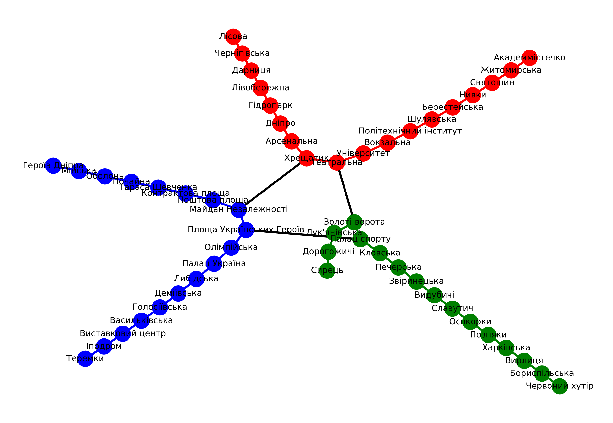

# goit-algo-hw-06. Графи

## 1. Граф «Київське метро»

Програмно реалізовано граф метро Києва.

Використані бібліотеки:

-   networkx
-   matplotlib.pyplot

Властивості графа:

-   Гілки метро з кольорами і умовною вагою в 1
-   Пішохідні переходи з окремим кольором і умовною вагою в 3
-   Зроблено візуалізацію графа



Аналіз характеристик графа за допомогою бібліотеки networkx:

```
Кількість станцій: 52
Кількість з'єднань станцій: 52, з них:
 - піших переходів: 3
 - сполучень метро: 49
Схема метро є зв'язним графом

Станції з найбільшою центральністю (Degree Centrality):
Станція Театральна..................0.05882353
Станція Хрещатик....................0.05882353
Станція Майдан Незалежності.........0.05882353
Станція Площа Українських Героїв....0.05882353
Станція Золоті ворота...............0.05882353
Станція Палац спорту................0.05882353

Станції з найвищою близкістю вузла (Closeness Centrality):
Станція Майдан Незалежності.........0.17465753
Станція Площа Українських Героїв....0.17465753
Станція Палац спорту................0.17465753
Станція Театральна..................0.17000000
Станція Хрещатик....................0.17000000
Станція Золоті ворота...............0.17000000
Станція Кловська....................0.15838509
Станція Олімпійська.................0.15644172

Станції з найвищим ступенем:
Станція Театральна..................3
Станція Хрещатик....................3
Станція Майдан Незалежності.........3
Станція Площа Українських Героїв....3
Станція Золоті ворота...............3
Станція Палац спорту................3

Кінцеві станції:
Станція Академмістечко..............1
Станція Лісова......................1
Станція Героїв Дніпра...............1
Станція Теремки.....................1
Станція Сирець......................1
Станція Червоний хутір..............1
```

## 2. Реалізація алгоритмів пошуку шляхів у графі: DFS, BFS

Програмно реалізовано алгоритми пошуку шляхів у графах:

-   **Пошук у глибину (DFS)** виконується шляхом відвідування вершини, а потім рекурсивного відвідування всіх сусідніх вершин, які ще не були відвідані. Алгоритм DFS може бути ефективним для знаходження циклу у графі або перевірки зв'язності графу. Однак DFS може бути неефективним для пошуку найкоротшого шляху у графі, особливо у графах з великою кількістю вершин та ребер.  
    `alg_dfs.py`
-   **Пошук у ширину (BFS)** відрізняється від DFS тим, що він відвідує всі вершини на певному рівні перед тим, як перейти до наступного рівня. BFS є корисним для знаходження найкоротшого шляху в незважених графах та при розв'язку завдань, які вимагають відвідування вершин у порядку, віддаленому від вихідної вершини.  
    `alg_bfs.py`

Алгоритми приймають на вхід граф, початок і кінець маршруту і повертають знайдений маршрут у вигляді списку.

Проведено тести пошуку маршруту між станціями Театральна і Арсенальна

-   **Пошук у глибину (DFS)** повертає маршрут довжиною 12 станцій.  
    `Відвідано станцій: 12, Відвідані станції DFS:  ['Театральна', 'Університет', 'Вокзальна', 'Політехнічний інститут', 'Шулявська', 'Берестейська', 'Нивки', 'Святошин', 'Житомирська', 'Академмістечко', 'Хрещатик', 'Арсенальна']`
-   **Пошук у ширину (BFS)** повертає маршрут в 3 станції:  
    `Відвідано станцій: 3, Відвідані станції BFS: ['Театральна', 'Хрещатик', 'Арсенальна']`

Експериментально підтверджується більша придатність для знаходження коротшого шляху алгоритму BFS: за рахунок поступового віддалення від початкового вузла він знаходить коротший маршрут. Алгоритм DFS натомість обирає напрямок і рухається по ньому до кінця, потім переходить до наступного напрямку.

## 3. Реалізація алгоритму Дейкстри

**Алгоритм Дейкстри** — це алгоритм пошуку найкоротшого шляху у графі з невід'ємними вагами ребер від однієї вершини до всіх інших.

Алгоритм реалізовано в модулі `alg_dijkstra.py`

```Py
def dijkstra(graph, start_vertex, end_vertex=None) -> dict:
    """Алгоритм Дейкстри

    Параметри:
        graph: dict - граф;
        start_vertex - початкова вершина;
        end_vertex - кінцева вершина.
    Повертає dict:
        distances:dict|int - відстані від початкової до всіх вершин, або відстань до заданої end_vertex.;
        path:list - оптимальний шлях якщо задана end_vertex або None.
    """
```

Алгоритм правильно знаходить найкоротший шлях між станціями

```
Оптимальний маршрут між станціями Театральна і Арсенальна:
Відстань: 2
Станції: ['Театральна', 'Хрещатик', 'Арсенальна']
```
